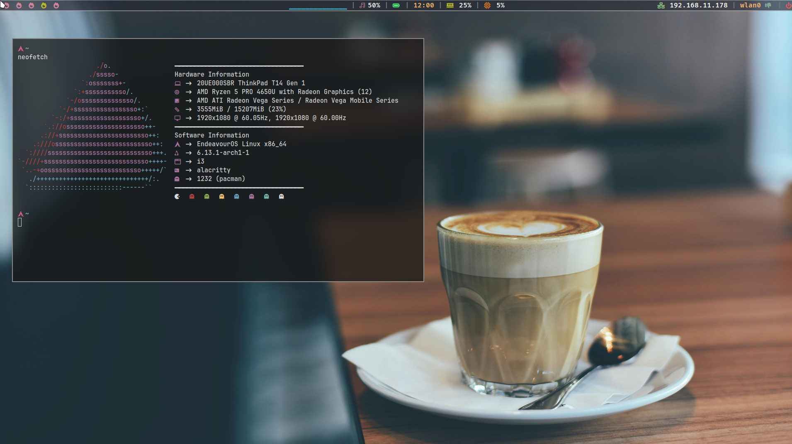

### 👾 Welcome to my EndeavourOS 👾

Feel free to explore my update archives, and if necessary, open a issue with your questions or suggestions.

---
### 🖥️ My current configuration:

| System | Name | Project site |
| --- | --- | --- |
| OS | EndeavourOS | https://endeavouros.com/ |
| TWM | i3wm | https://i3wm.org/ |
| Bar | Polybar | https://polybar.github.io/ |
| Menu | Rofi | https://github.com/davatorium/rofi |
| Terminal | Alacritty | https://alacritty.org/ |
| Compositor | Picom | https://github.com/yshui/picom |

---
### 🚀 PrintScreen

